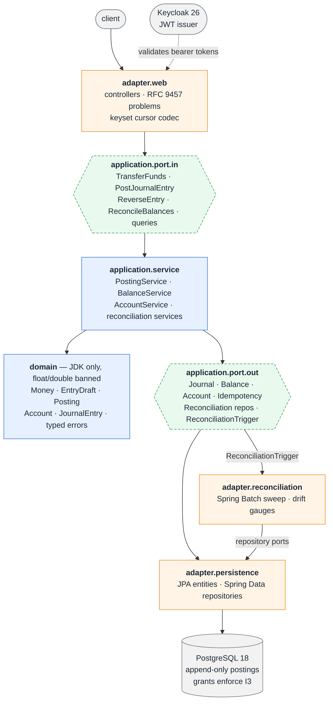
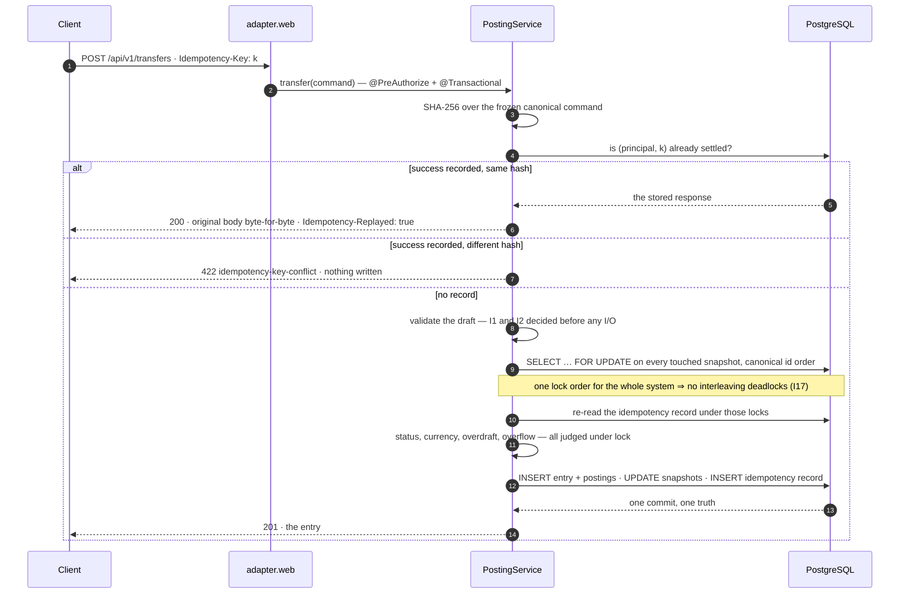
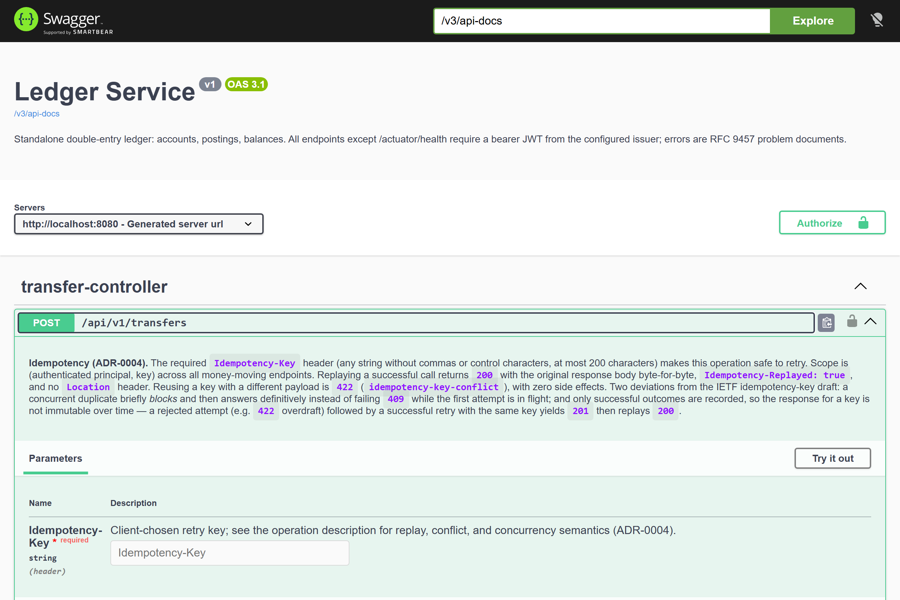

# Ledger Service

[](https://github.com/essandhu/ledger-service/actions/workflows/ci.yml)


<sub>[`docs/media/tour.sh`](docs/media/tour.sh) against the compose stack — real Keycloak tokens,
real HTTP, and **every line asserted**, so a regressed invariant fails the recording instead of
faking it. A ~20-second cut of [`scripts/demo.sh`](scripts/demo.sh); see
[docs/media/](docs/media/README.md) for how it is regenerated.</sub>

A standalone, production-grade **double-entry ledger service** (Java 21 · Spring Boot 4.1 ·
PostgreSQL 18). The differentiator: **every guarantee is backed by an automated test that proves
it** — balanced entries, immutable history, overdraft safety under concurrency, idempotent writes,
and reconciliation that turns "could the balance drift?" into a monitored metric.

## The guarantees

Seventeen invariants, each with an ID that appears verbatim in the display names of the tests
that prove it — `grep -r "I4" src/test` maps any claim below to its proofs. The contested design
decisions behind them live in [docs/adr/](docs/adr/README.md), each ADR ending with the tests
that enforce it.

| ID | Guarantee | Proof (primary) | Lane |
|---|---|---|---|
| I1 | Every entry's postings sum to **exactly zero per currency** — integer equality, no epsilon | [EntryDraftTest](src/test/java/io/github/essandhu/ledger/domain/model/EntryDraftTest.java) · [EntryDraftPropertyTest](src/test/java/io/github/essandhu/ledger/domain/model/EntryDraftPropertyTest.java) | unit + property |
| I2 | ≥ 2 postings per entry, every amount nonzero — also a DB `CHECK` | [EntryDraftTest](src/test/java/io/github/essandhu/ledger/domain/model/EntryDraftTest.java) · [JournalSchemaIntegrationTest](src/test/java/io/github/essandhu/ledger/JournalSchemaIntegrationTest.java) | unit + integration |
| I3 | Entries and postings are **immutable** — the runtime DB role cannot `UPDATE`/`DELETE` them | [PostingImmutabilityIntegrationTest](src/test/java/io/github/essandhu/ledger/PostingImmutabilityIntegrationTest.java) | integration (real privilege errors) |
| I4 | Snapshot balance **equals Σ postings** after every committed transaction | [PostingConservationPropertyIntegrationTest](src/test/java/io/github/essandhu/ledger/PostingConservationPropertyIntegrationTest.java) · [StatefulModelPropertyIntegrationTest](src/test/java/io/github/essandhu/ledger/StatefulModelPropertyIntegrationTest.java) | property + model-vs-SUT |
| I5 | **Conservation**: the whole ledger sums to zero per currency, always | [PostingConservationPropertyIntegrationTest](src/test/java/io/github/essandhu/ledger/PostingConservationPropertyIntegrationTest.java) | property |
| I6 | `allowNegative=false` accounts **never** observe a negative natural balance — under any interleaving | [OverdraftRaceConcurrencyTest](src/test/java/io/github/essandhu/ledger/concurrency/OverdraftRaceConcurrencyTest.java) | concurrency hammer |
| I7 | **No lost updates**: N concurrent deposits land exactly N times | [DepositRaceConcurrencyTest](src/test/java/io/github/essandhu/ledger/concurrency/DepositRaceConcurrencyTest.java) | concurrency hammer |
| I8 | **Idempotent replay**: one entry ever per (principal, key, payload); replays return the original, marked `Idempotency-Replayed: true` | [IdempotencyApiIntegrationTest](src/test/java/io/github/essandhu/ledger/adapter/web/IdempotencyApiIntegrationTest.java) · [IdempotencyRaceConcurrencyTest](src/test/java/io/github/essandhu/ledger/concurrency/IdempotencyRaceConcurrencyTest.java) | integration + concurrency |
| I9 | **Idempotency conflict**: same key, different payload → `422`, zero side effects | [IdempotencyPropertyIntegrationTest](src/test/java/io/github/essandhu/ledger/IdempotencyPropertyIntegrationTest.java) | property |
| I10 | **As-of consistency**: `asOf(t2) − asOf(t1) = Σ postings in (t1, t2]` | [AsOfConsistencyPropertyIntegrationTest](src/test/java/io/github/essandhu/ledger/AsOfConsistencyPropertyIntegrationTest.java) | property |
| I11 | A **reversal** negates its original exactly, at most once — including under a double-reversal race | [ReversalApiIntegrationTest](src/test/java/io/github/essandhu/ledger/adapter/web/ReversalApiIntegrationTest.java) | integration |
| I12 | **Posting integrity**: currency match, `ACTIVE`-only postings, `CLOSED` is terminal and requires zero balance | [LifecycleVsPostingIntegrationTest](src/test/java/io/github/essandhu/ledger/adapter/web/LifecycleVsPostingIntegrationTest.java) · [AccountTest](src/test/java/io/github/essandhu/ledger/domain/model/AccountTest.java) | unit + integration |
| I13 | **AuthZ matrix**: every endpoint × {no token, wrong role, right role} — one parameterized table, extended every milestone | [AuthzMatrixIntegrationTest](src/test/java/io/github/essandhu/ledger/config/AuthzMatrixIntegrationTest.java) | integration (minted JWTs) |
| I14 | **Architecture**: hexagonal dependency rules — domain depends on the JDK only; `float`/`double` banned from the core | [HexagonalArchitectureTest](src/test/java/io/github/essandhu/ledger/architecture/HexagonalArchitectureTest.java) | ArchUnit |
| I15 | **Reconciliation detects drift**: a snapshot corrupted out-of-band is flagged within one run — finding row + gauges | [ReconciliationJobIntegrationTest](src/test/java/io/github/essandhu/ledger/adapter/reconciliation/ReconciliationJobIntegrationTest.java) | integration (seeded drift) |
| I16 | **Migrations are sound**: clean-migrate from empty, immutable checksums, grants match I3 after every migration | [WalkingSkeletonTest](src/test/java/io/github/essandhu/ledger/WalkingSkeletonTest.java) · schema suites | integration |
| I17 | **Deadlock-freedom** under sustained bidirectional transfer hammering — any `40P01` fails the test | [BidirectionalTransferConcurrencyTest](src/test/java/io/github/essandhu/ledger/concurrency/BidirectionalTransferConcurrencyTest.java) | concurrency hammer |

Three proofs are DB-shaped rather than code-shaped, on purpose: I3 is a **grant**, not a code
path (the app's own role gets `permission denied` — try it, the demo does); I8's backstop is a
**partial unique index** that makes double-posting unable to commit regardless of application
bugs; I16 asserts the grants after every migration so neither can silently regress.

## Why this design

Common ad-hoc money mistakes, and what this ledger does instead:

| Ad-hoc failure | Ledger answer |
|---|---|
| `double` arithmetic loses cents | Integer minor units end-to-end: `long` → `BIGINT` → JSON integer ([ADR-0001](docs/adr/ADR-0001-money-representation.md)) |
| Single-row "transfers" | Balanced multi-leg journal entries — money moves, it never appears |
| `UPDATE balance = ...` in place | Append-only postings; the snapshot is derived, serialized under ordered locks ([ADR-0002](docs/adr/ADR-0002-balance-storage.md), [ADR-0003](docs/adr/ADR-0003-concurrency-control.md)) |
| Client retries double-charge | `Idempotency-Key` with byte-identical replay ([ADR-0004](docs/adr/ADR-0004-idempotency.md)) |
| Trusted stored balances | A scheduled-able reconciliation sweep recomputes everything and gauges the drift (I15) |
| `UPDATE`/`DELETE` as "fixes" | Immutable entries + linked reversals; the runtime role *cannot* mutate history (I3) |

## Architecture

Architecture is hexagonal (ports & adapters) in a single Gradle module — the boundaries are
enforced by [ArchUnit rules that fail the build](src/test/java/io/github/essandhu/ledger/architecture/HexagonalArchitectureTest.java),
not by convention: a framework-free domain core, use-case services owning the transaction
boundary, and Spring/JPA/web/Batch confined to adapters. Property-based testing runs on an
in-repo harness ([ADR-0005](docs/adr/ADR-0005-property-testing-tooling.md) explains why not
jqwik on JUnit Platform 6).

The diagram below follows a request inward. The dashed hexagons are the **ports** — interfaces
the core owns — and every arrow crossing one is a call against an interface, never against a
class; the compile-time dependencies run the other way, from adapters into the core, which is
precisely what I14 checks. Two adapters therefore sit on both sides of the boundary:
`adapter.web` also *implements* an out-port (`WriteResponseRenderer`, which stores the
byte-for-byte body an idempotent replay returns), and `adapter.reconciliation` exists mainly to
implement `ReconciliationTrigger`.



### The write path

Every money mover — journal entry, transfer, reversal — funnels through one method with one
critical section. The idempotency verdict comes first (a replay executes nothing at all), then
draft validation with no I/O, then a single lock site that orders account ids canonically, and
only then anything account-dependent. That ordering is what makes I6, I8, I9 and I17
simultaneously true, and it is the subject of
[ADR-0003](docs/adr/ADR-0003-concurrency-control.md) and
[ADR-0004](docs/adr/ADR-0004-idempotency.md).



## API

Base path `/api/v1`; errors are RFC 9457 `application/problem+json` with stable type slugs
(`…/problems/overdraft`, `…/problems/idempotency-key-conflict`, …). Bearer JWT everywhere except
`/actuator/health`; **no role hierarchy** — ADMIN cannot read, WRITE cannot scrape, composite
roles in Keycloak are the convenience path.

| Method & path | Role |
|---|---|
| `POST /accounts` · `PATCH /accounts/{id}` | `LEDGER_ADMIN` |
| `GET /accounts` · `GET /accounts/{id}` | `LEDGER_READ` |
| `POST /transfers` · `POST /journal-entries` · `POST /journal-entries/{id}/reversal` | `LEDGER_WRITE` |
| `GET /journal-entries/{id}` | `LEDGER_READ` |
| `GET /accounts/{id}/balance[?at=…]` — O(1) snapshot; as-of recomputed from postings | `LEDGER_READ` |
| `GET /accounts/{id}/postings` — keyset-paginated, account-bound opaque cursor | `LEDGER_READ` |
| `POST /reconciliation-runs` — synchronous sweep, `201` whatever the verdict | `LEDGER_ADMIN` |
| `GET /reconciliation-runs/{id}[/findings]` | `LEDGER_READ` |
| `GET /reconciliation-runs?page=&size=` — run history, **newest first** (descending id = reverse chronological) | `LEDGER_READ` |
| `GET /actuator/metrics` · `GET /actuator/prometheus` | `LEDGER_METRICS` ([ADR-0006](docs/adr/ADR-0006-observability-exposure.md)) |

**Idempotency in one paragraph** (full text in the OpenAPI spec, [ADR-0004](docs/adr/ADR-0004-idempotency.md)):
the three money movers require an `Idempotency-Key` (comma-free, ≤ 200 chars). Successful
replays return `200` + the original body byte-for-byte + `Idempotency-Replayed: true`; a reused
key with a different payload is a `422` conflict with zero side effects. Two deliberate
deviations from the IETF draft: concurrent duplicates briefly **block and answer definitively**
(no `409`-while-in-flight), and only successes are recorded — a `422` today can become a `201`
on a corrected retry, so responses for a key are not immutable over time.

The OpenAPI spec is generated from the code, asserted by
[OpenApiDocumentationTest](src/test/java/io/github/essandhu/ledger/OpenApiDocumentationTest.java),
and published as a CI artifact on every build — it cannot be stale. Swagger UI at
`/swagger-ui.html` (any authenticated token).



<sub>The idempotency contract is not README-only prose: it is on the operation in the generated
spec, which [ADR-0004](docs/adr/ADR-0004-idempotency.md) discharges through an
`OperationCustomizer` so the documentation cannot drift from the code.</sub>

## Quickstart

Requirements: Docker (that's it — the JDK is toolchain-resolved, Gradle comes from the wrapper;
the demo script additionally wants `jq`).

```sh
docker compose up -d --build --wait   # PostgreSQL 18 + Keycloak (realm pre-provisioned) + the service
./gradlew build                       # every suite in both core lanes + the console suite + both coverage gates
                                      # (except the console's browser lane — it needs a running console; see Testing & CI)
```

Dev endpoints: service `http://localhost:8080` · Keycloak `http://localhost:8081`
(realm `ledger`, demo clients `ledger-cli` / `ledger-readonly` / `ledger-metrics`) · Keycloak
health `http://localhost:9000/health/ready`.

### The demo

```sh
scripts/demo.sh                  # fresh stack, then the whole story end-to-end
scripts/demo.sh --observability  # same, plus Prometheus + Grafana
```

One scripted pass over everything above, with real Keycloak tokens: the role matrix (including
the 403s), a balanced transfer, the rejection vocabulary (unbalanced, overdraft, frozen), a
`permission denied` from PostgreSQL itself when the app's role tries to `UPDATE` a posting,
balances and as-of algebra, idempotent replay / tamper conflict, exact reversal — and the
finale: a superuser corrupts a snapshot **out-of-band**, the reconciliation sweep convicts it
(finding row, delta, Prometheus gauges), the snapshot is repaired by recomputation, and the
final sweep reads CLEAN again.

The GIF at the top of this README is [`docs/media/tour.sh`](docs/media/tour.sh) — the same story
against an already-running stack, so it fits in twenty seconds. It is equally assertion-bearing
and safe to re-run.

## Observability

Micrometer → `/actuator/prometheus`, guarded by the dedicated `LEDGER_METRICS` role — the
scraper can scrape and do nothing else ([ADR-0006](docs/adr/ADR-0006-observability-exposure.md)
records why a role beat a management-port split here, and why the Prometheus scrape uses OAuth2
client-credentials instead of a static token).

| Metric | What it tells you |
|---|---|
| `ledger.reconciliation.drift.accounts` / `.drift.absolute` | **The headline gauges**: accounts adrift and Σ\|delta\| at the last completed run |
| `ledger.reconciliation.runs{outcome}` / `.duration` | Sweep outcomes (`clean`/`drift`/`failed`) and duration |
| `ledger.posting.duration{entry_type,outcome}` | Posting latency, split by entry type and posted/rejected |
| `ledger.posting.rejected{reason}` | Rejections by problem-type slug, verbatim |
| `ledger.posting.lock.wait` | Time in the ordered `FOR UPDATE` acquisition — the hot-account signal |
| `ledger.idempotency.replayed` / `.conflict` | Retries answered from the record; tampered reuses |

`docker compose --profile observability up -d` adds Prometheus (v3.13) and Grafana (13.1) with a
provisioned dashboard (anonymous viewer at `http://localhost:3000`). Teardown needs the profile
too: `docker compose --profile observability down`.


<sub>Caught in the act: the gauges are red because drift was induced out-of-band first — the same
superuser `UPDATE` the demo uses, which the application's own role cannot perform (I3) — and the
sweep convicted it. The capture script repairs the snapshot by recomputation and re-verifies
`CLEAN` before exiting; see [docs/media/](docs/media/README.md).</sub>

> **Upgrading an existing stack:** Keycloak's `--import-realm` skips realms that already exist,
> so an old `pgdata` volume is missing whatever the realm file gained since it was created —
> pre-M7, the `LEDGER_METRICS` role and `ledger-metrics` client (metric calls 403 and the
> Prometheus scrape fails); pre-M8, the `ledger-console` client and the `ops`/`viewer` demo
> users (the console still boots, but browser login dead-ends on Keycloak's "Client not found"
> page). Reset with `docker compose down -v` (or run `scripts/demo.sh`, which always starts
> fresh).

## Console

A read-only web console for the ledger's actual audience — ops and finance — at
`http://localhost:8090`. It is a **separate Spring Boot app** that logs users in against
Keycloak (authorization code) and calls this API with the user's own token: the core stays a
pure resource server, its security posture unchanged, and the console becomes the API's first
real consumer ([ADR-0007](docs/adr/ADR-0007-read-only-console.md) records why not a SPA, why not
an embedded UI, and the six sub-decisions underneath).

```sh
docker compose up -d --build --wait   # the console needs Keycloak alive at STARTUP
./gradlew :console:bootRun            # then http://localhost:8090 — sign in as ops/ops
```

Server-rendered Thymeleaf with htmx as a vendored static file — no CORS surface on the core, no
second toolchain, no API-versioning pressure invented by our own frontend. The pages are a
window onto the invariants rather than a CRUD skin:

| Page | What it makes visible |
|---|---|
| Accounts → account detail | the **natural** balance (raw × direction of type — a LIABILITY at raw −12345 reads +123.45) beside the raw figure, an as-of picker, and the keyset statement with htmx load-more |
| Entry inspector | the legs of an entry summing to a rendered **zero**, per currency — I1, on screen |
| Reconciliation → run history → findings | snapshot vs computed vs delta — **I15**, on screen. Newest run first; each finding links back to the drifted account |
| Whoami | the no-hierarchy role model as chips: every `LEDGER_*` grant the API checks, and a dashed `CONSOLE_*` composite that merely expands to them |

Two demo users, both sides of the role matrix: `ops`/`ops` (composite `CONSOLE_OPS` →
`LEDGER_READ` + `LEDGER_ADMIN` + `LEDGER_METRICS`) and `viewer`/`viewer` (`LEDGER_READ` only).
The one permitted action is triggering a reconciliation sweep — additive-safe audit history, not
money movement, so "read-only" stays honest where it matters. A viewer never sees the button; a
viewer who posts anyway is refused **by the ledger**, not by a second copy of the role matrix
living in the console, and that 403 renders as the problem document it is. Money exponents are
console-owned (JPY 0, EUR 2, BHD 3 — closing the
[ADR-0001](docs/adr/ADR-0001-money-representation.md) loop), UTC instants render browser-local,
and every API failure surfaces its RFC 9457 problem body rather than a generic apology.

Existing stacks need the realm refresh noted above (`docker compose down -v`) before browser
login works. `scripts/demo.sh --console` prints the URL and credentials after the walkthrough —
and the drift finding it points you at is still there after the demo repairs the snapshot,
because findings are write-once and the run history is append-only.

## Testing & CI

| Lane | Contents | Where |
|---|---|---|
| default (`./gradlew test`) | unit, property, ArchUnit, Testcontainers integration (one context, one PostgreSQL) | CI "Build, test, coverage gate" |
| stress (`./gradlew concurrencyTest`) | the I6/I7/I8/I17 hammers — never cached, re-samples interleavings every run | CI "Concurrency proof" |
| smoke | compose up + scripted probes over the real Keycloak issuer, including the drift demo | CI "docker-compose smoke test" |
| console (`./gradlew :console:build`) | the read-only console's suite — login chain, role rendering, money/time/error presentation, the reconciliation surfaces, its own coverage gate | CI "Console build" |
| console e2e (`./gradlew :console:e2eTest`) | a real browser (Playwright, chromium) through the real Keycloak login against the compose stack + the host-run console — deliberately outside `check` | CI "Console E2E" |

The core's JaCoCo gate is `check`-fatal at **0.90 line coverage** overall, with a second exact
rule: the domain packages hold **100%** — every uncovered domain line is treated as either a
missing proof or code that should not exist. (The only uncovered code in the core service is
the bootstrap `main()` and a catch for a JRE that lacks SHA-256, which the Java spec forbids —
four lines, both outside domain.) The console subproject carries its own separate gate,
starting at **0.70** where the core's ratchet started
([ADR-0007](docs/adr/ADR-0007-read-only-console.md)). Mutation testing (PIT) is wired as a
non-gating report: `./gradlew pitest`.

## Stack

Java 21 · Spring Boot 4.1 (Framework 7, Security 7.1, Batch 6, JUnit 6) · PostgreSQL 18 ·
Keycloak 26.7 · Gradle 9.6 · Flyway · Testcontainers 2 · springdoc 3 · JaCoCo · PIT.
Versions are pinned in [gradle/libs.versions.toml](gradle/libs.versions.toml) with the
reasoning inline; everything Boot-BOM-managed is deliberately not repeated there.

Deliberate v1 scope: single currency per account (multi-currency entries balance per currency);
no FX, holds, or multi-tenancy — the future-ADR candidates are listed in
[docs/adr/README.md](docs/adr/README.md).

All credentials in this repo are dev/demo-only values for the local compose stack.
